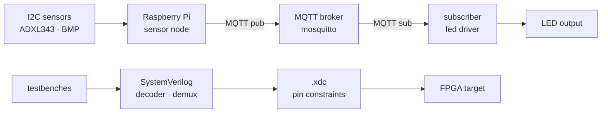

# CPS · Digital Design

**Cyber-Physical Systems coursework - sensor nodes, MQTT, accelerometry, and SystemVerilog FPGA design. Indiana University E222, Spring 2026.**

 

---

## What this is

Completed lab + project artifacts from **IU E222 · Cyber-Physical Systems / Digital Design** (Spring 2026). Mirrored publicly from the IU-internal `github.iu.edu` repo for portfolio reference.

**Co-authored with Wilder Lorch.** The project table below preserves per-deliverable credit.

If you are a current E222 student - this is a completed past submission. Please don't copy it; the point of the class is in the doing.

---

## Scope of work

The course spans two stacks stitched together under one term:

1. **Sensor + networking stack** on Raspberry Pi - I²C sensors (ADXL343 accelerometer, BMP/pressure-temp), MQTT pub/sub for distributed sensor nodes, Python orchestration.
2. **Digital design stack** in SystemVerilog - combinational decoders, demultiplexers, testbenches, constraint files for an FPGA target (Xilinx/AMD toolchain via `.xdc` constraints).

---

## Layout

| Path | Stack | Purpose |
|------|-------|---------|
| `Project_1_testing_connection.py` | Python / RPi | Initial connectivity + environment sanity check |
| `Ips331_class.py` | Python | IPS331 class wrapper (power-management IC) |
| `adxl343.py` | Python / I²C | ADXL343 accelerometer driver |
| `read_pressure_temp.py` | Python / I²C | Pressure + temperature sensor reader |
| `led_driver.py` | Python / GPIO | LED output driver, MQTT-subscribed |
| `sensor_node.py` | Python / MQTT | Combined sensor-node runner - publishes accelerometer + pressure data |
| `lab4.py` | Python | Lab 4 deliverable |
| `Lab4` | Notes | Lab 4 short-form notes |
| `Project_5/` | SystemVerilog | `decoder.sv`, `demux.sv`, `top.sv`, `top.xdc`, testbenches |

---

## Project table

| Deliverable | Date | Focus |
|-------------|------|-------|
| P0 - project plan | 1/14/2026 | Scoping |
| P1 - initial build | 1/21/2026 | Connectivity + env |
| P2 - sensor integration | 1/28/2026 | I²C + driver wiring |
| P3 - multi-sensor node | 2/04/2026 | Combined sensor runner |
| P4 - MQTT + LED control | 2/11/2026 | `on_connect` handler; `mosquitto_pub` verification |
| P5 - SystemVerilog 3→8 decoder + demux | 2/25 – 3/3/2026 | `decoder.sv`, `demux.sv`, `top.sv`, `.xdc`, testbenches |

---

## Why this is on my public profile

Embedded systems and HPC sit on opposite ends of the compute stack - pin-level timing on one side, cache-line microbenchmarks on the other. Doing both is deliberate. The research program I care about (cache behaviour in quant-finance kernels) benefits directly from hardware literacy, and this coursework is where that literacy was sharpened.

---

## License & authorship

- **MIT** for code solely authored by me
- Portions of `Project_5/` were co-authored with **Wilder Lorch** and are shared with the understanding that each contributor retains rights to their authored portions
- Course materials, prompts, and grading rubrics are property of Indiana University - not redistributed here

---

Co-authored with Wilder Lorch · Part of <a href="https://github.com/pbathuri">@pbathuri</a>'s <a href="https://github.com/pbathuri/Map_Projects_MAC">project portfolio</a> - embedded systems coursework.

